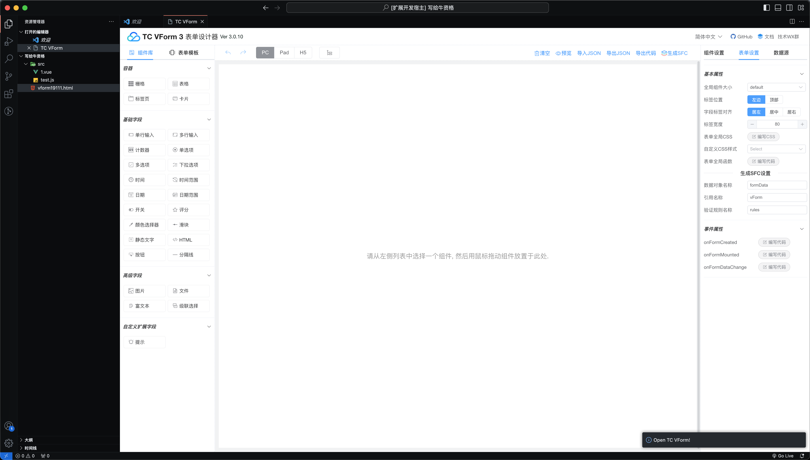

# tc-vform README

tc-vform-maker是一个致力于提高生产力的工具，基于低代码模式为你的前端项目自动生成可用的表单工具。

## Features

插件预览：

## Requirements

If you have any requirements or dependencies, add a section describing those and how to install and configure them.

## Release Notes

Users appreciate release notes as you update your extension.

### 0.0.2

更新插件图标。

### 0.0.1

第一个版本，实现了基本功能。

---

## For more information

* [表单设计器使用文档](https://www.vform666.com/document3.html)

**Enjoy!**
